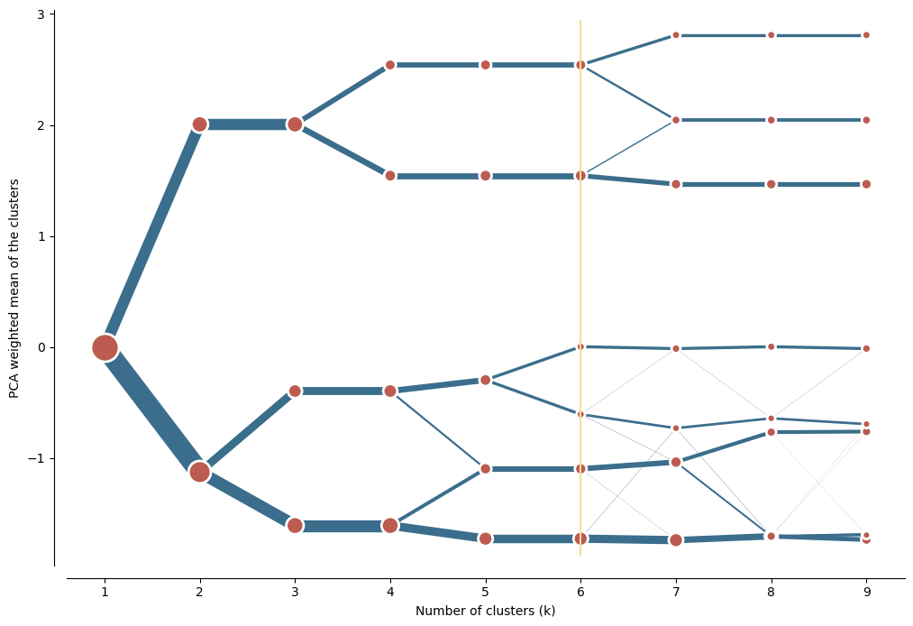
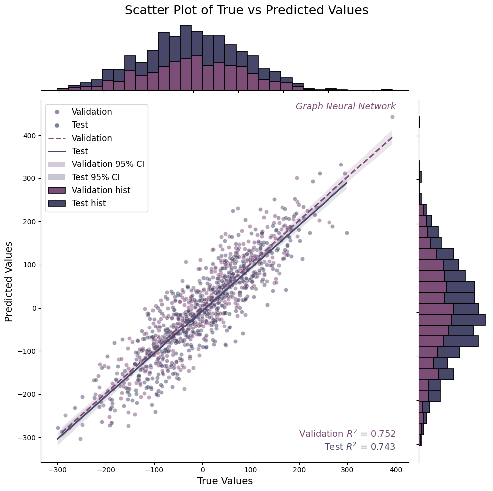
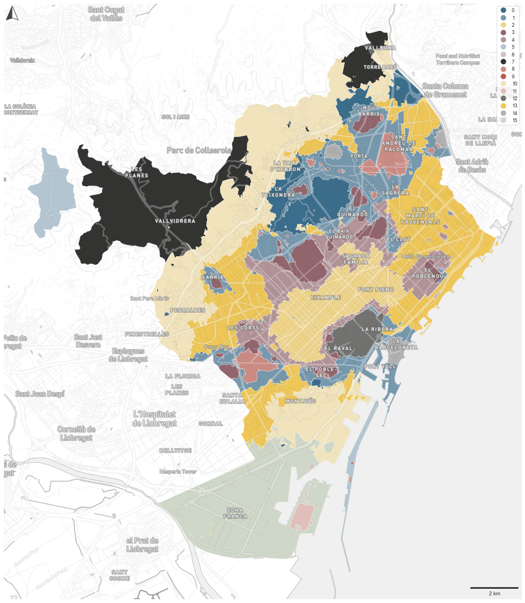

# 可视化示例集

- 本项目持续更新一系列的可视化示例，所有示例均基于 Python 生态（如 Matplotlib、Seaborn、Geopandas）实现，适用于数据分析和地理信息科学（GIS）相关领域。

# 📖 目录

- [当前可视化示例](#当前可视化示例)
  - [1. cluster_gram](#cluster_gramipynb)
  - [2. scatter_regplot](#scatter_regplotipynb)
  - [3. urban_grammar](#urban_grammaripynb)
- [持续更新](#持续更新)

# 当前可视化示例

## cluster_gram.ipynb
- 聚类分析的可视化

 

## scatter_regplot.ipynb
- 结合散点图与回归曲线，揭示变量间的相关性

 

## urban_grammar.ipynb
- 空间数据的配色方案

# 持续更新

- 我会不断添加新的可视化示例，并优化现有内容！欢迎 star ⭐ 本项目，并关注后续更新。  

📬 欢迎交流：如果你对可视化方法、数据分析或城市研究感兴趣，欢迎提交 issue 或讨论你的想法！
