# 可视化示例集

- 本项目持续更新一系列的可视化示例，所有示例均基于 Python 生态（如 Matplotlib、Seaborn、Geopandas）实现，适用于数据分析和地理信息科学（GIS）相关领域。

- 前面几个示例做了函数封装，但感觉封装之后不太好做自定义调整，索性后面的示例就按照边填代码边可视化的形式出图。

# 📖 目录

- [📌当前可视化示例](#当前可视化示例)
  - [1. cluster_gram](#cluster_gramipynb)
  - [2. scatter_regplot](#scatter_regplotipynb)
  - [3. urban_grammar](#urban_grammaripynb)
  - [4. scatter_kde](#scatter_kdeipynb)
  - [5. regression_comparison](#regression_comparisonipynb)
  - [6. scatter_regplot_annotation](#scatter_regplot_annotationipynb)
  - [7. scatter_style1](#scatter_style1ipynb)
  - [8. global_temperature](#global_temperatureipynb)
  - [9. bar_line_twin](#bar_line_twinipynb)
  - [10. bivariat_map](#bivariat_mapipynb)
  - [11. diverging_bar](#diverging_baripynb)
  - [12. stacked_bar](#stacked_baripynb)
  - [13. polar_bar](#polar_baripynb)
  - [14. polar_bar1](#polar_bar1ipynb)
  - [15. bar_wordcloud](#bar_wordcloudipynb)
  - [16. polar_line_scatter](#polar_line_scatteripynb)
  - [17. ternary_map](#ternary_mapipynb)
  
- [🚀持续更新](#持续更新)

# 📌当前可视化示例

## cluster_gram.ipynb
- 聚类分析的可视化

 

## scatter_regplot.ipynb
- 结合散点图与回归曲线

 

## urban_grammar.ipynb
- 空间数据的配色方案

## scatter_kde.ipynb
- 带有KDE估算的散点图

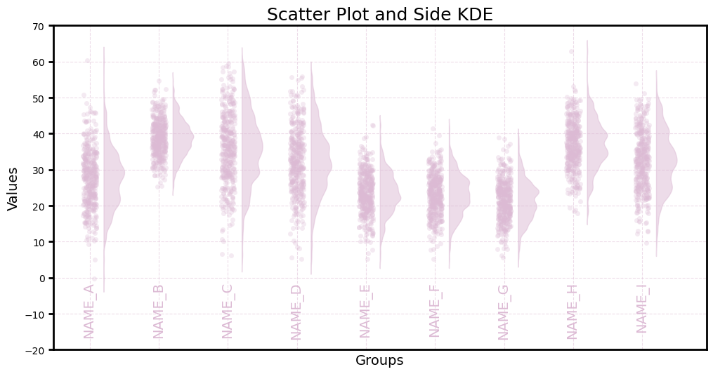

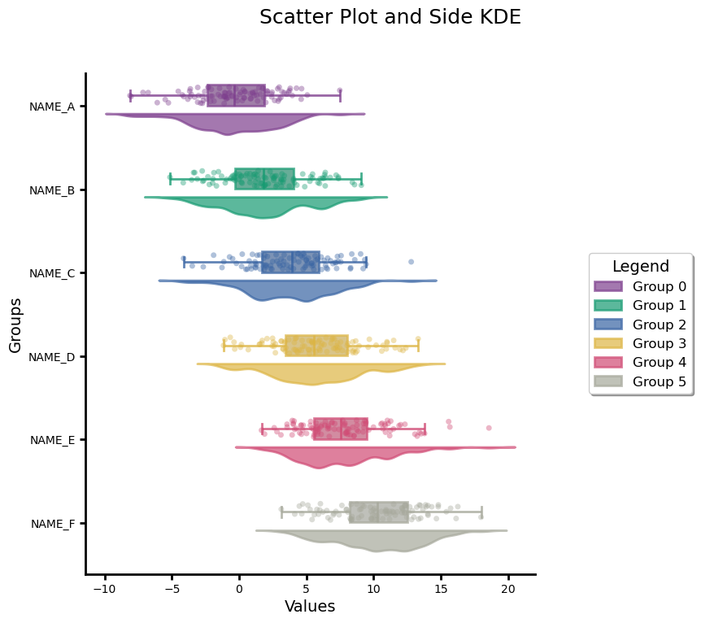

## regression_comparison.ipynb
- 可视化回归模型的拟合效果

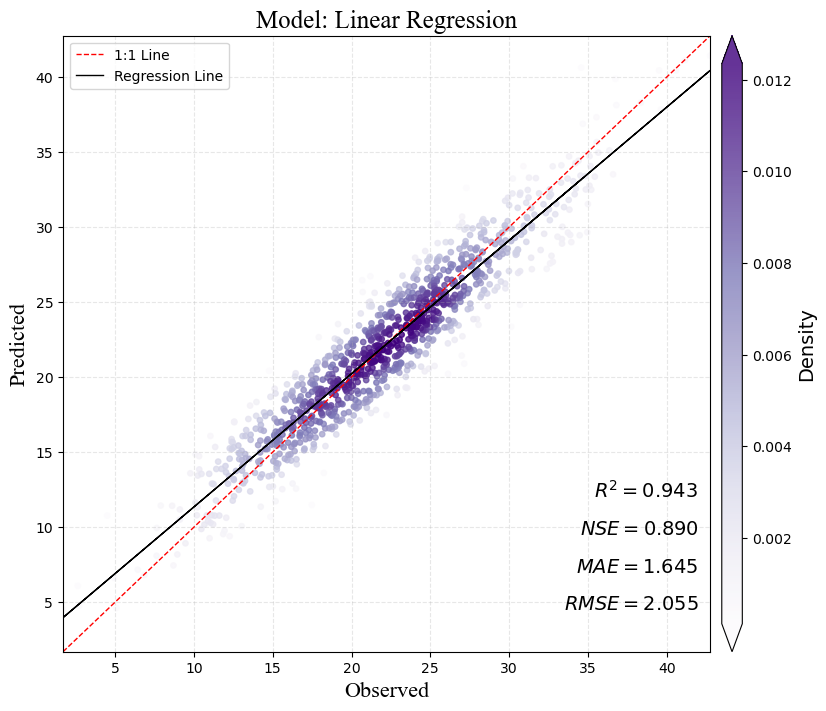

## scatter_regplot_annotation.ipynb
- 可视化散点图与回归曲线，并做图例调整

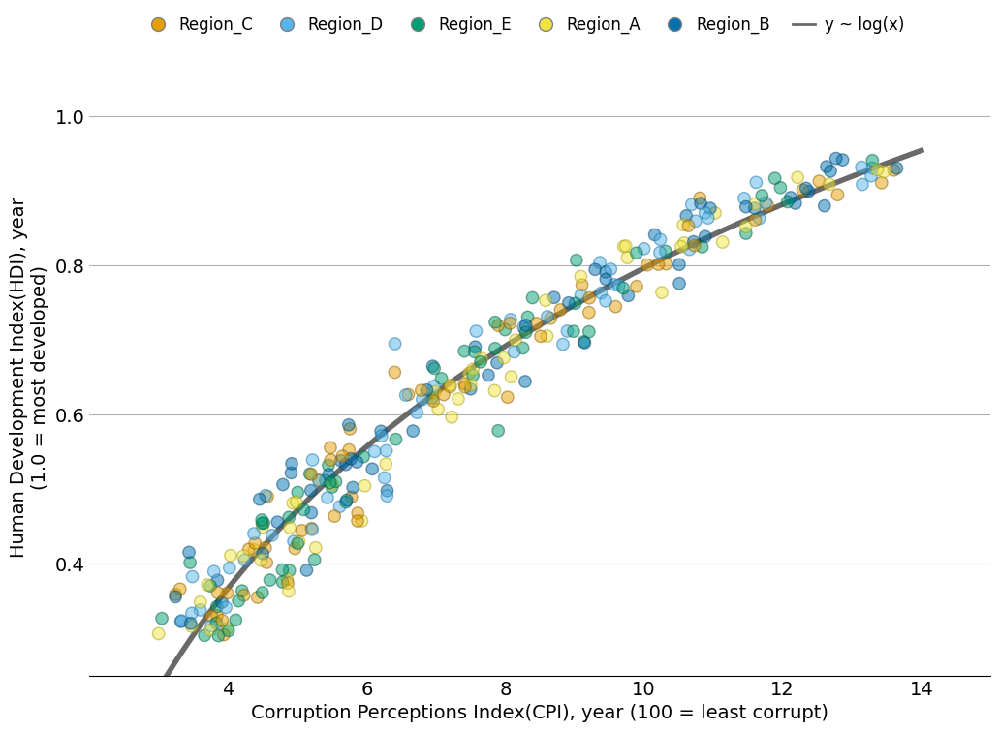

## scatter_style1.ipynb
- 两个散点图堆叠在一起，视觉冲击感强

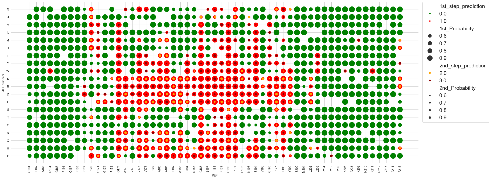

## global_temperature.ipynb
- 全球尺度的温度地图，底部放置了指定区域的辐射强度

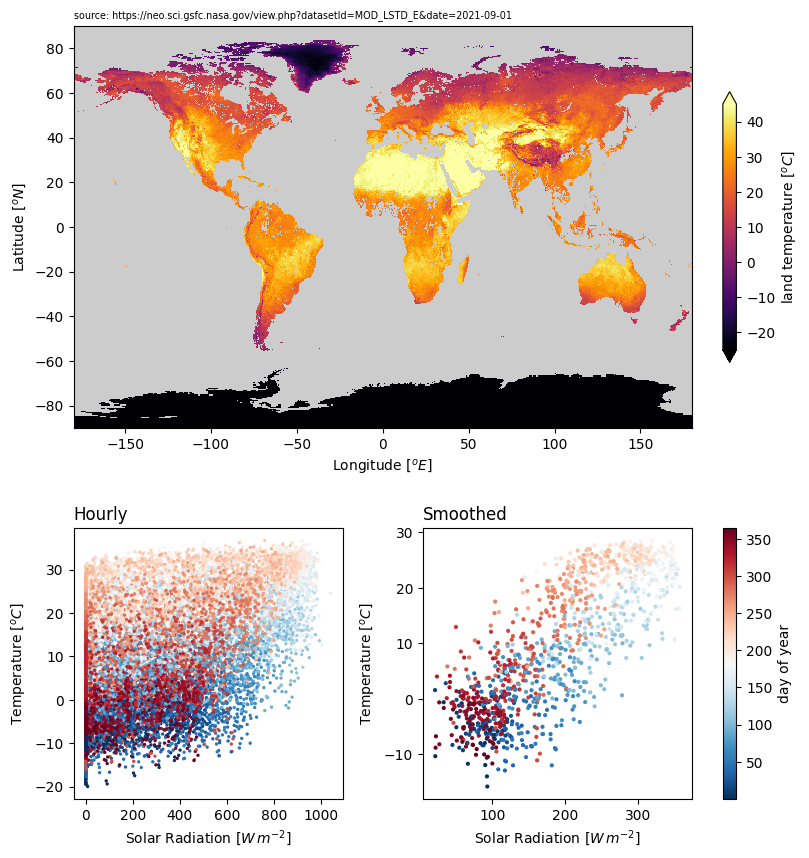

## bar_line_twin.ipynb
- 柱状图和折线图的叠加，使用双y坐标轴

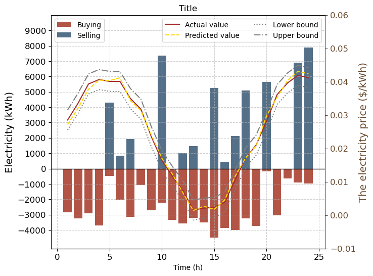

## bivariat_map.ipynb
- 双变量变化的地图可视化

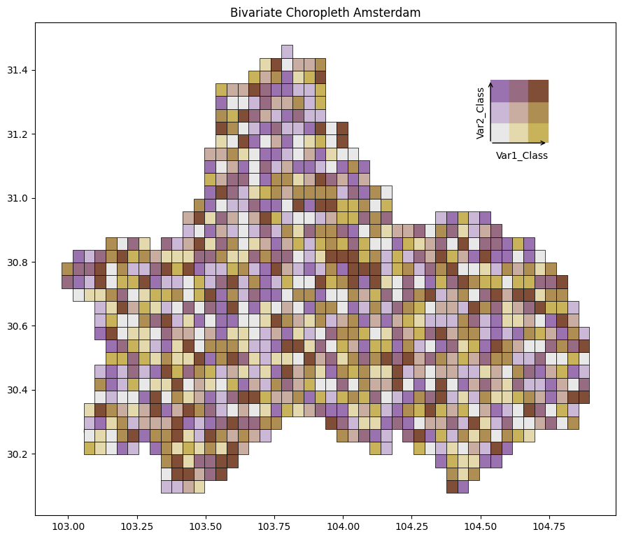

## diverging_bar.ipynb
- 双向柱状图，并添加对应散点

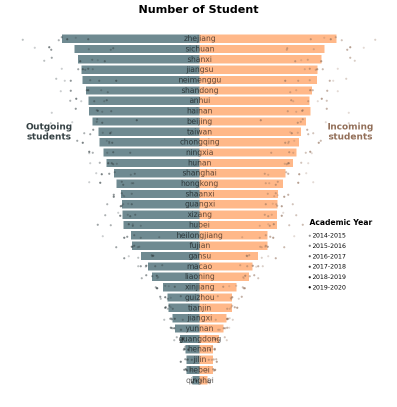

## stacked_bar.ipynb
- 堆叠柱状图

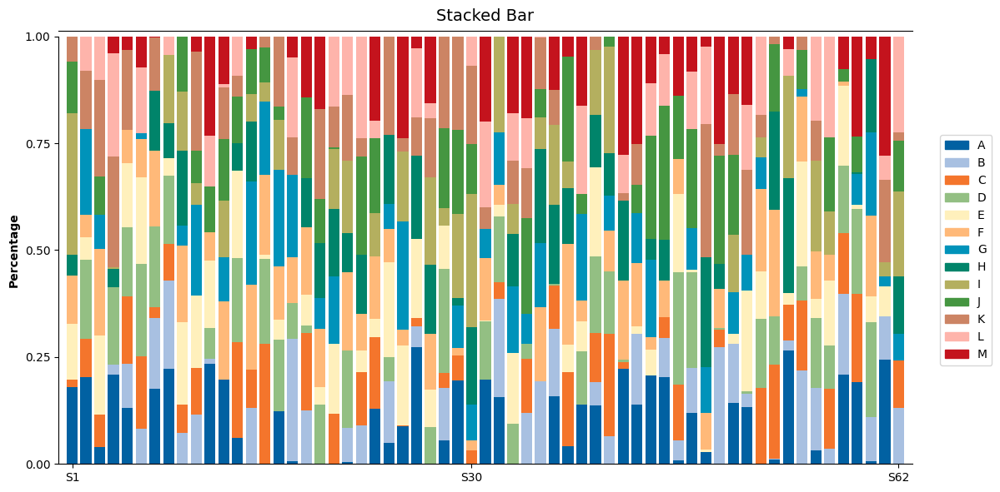

## polar_bar.ipynb
- 极坐标形式的柱状图

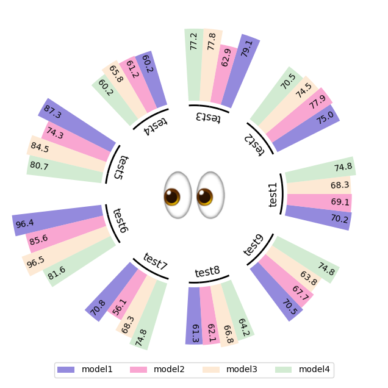

## polar_bar1.ipynb
- 极坐标形式的柱状图

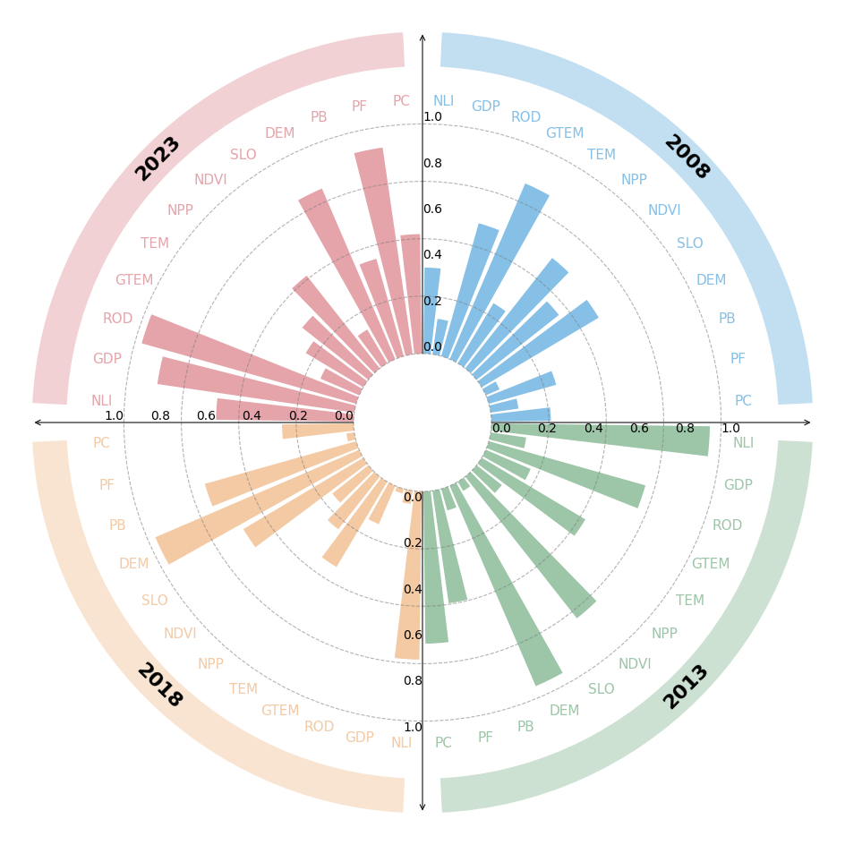

## bar_wordcloud.ipynb
- 极坐标形式的柱状图和词云图的组合

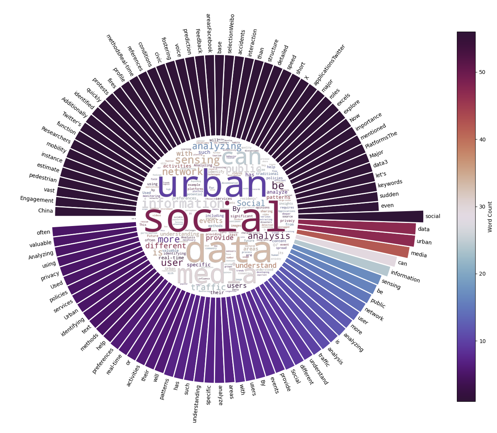

## polar_line_scatter.ipynb
- 极坐标形式的折线/散点图组合

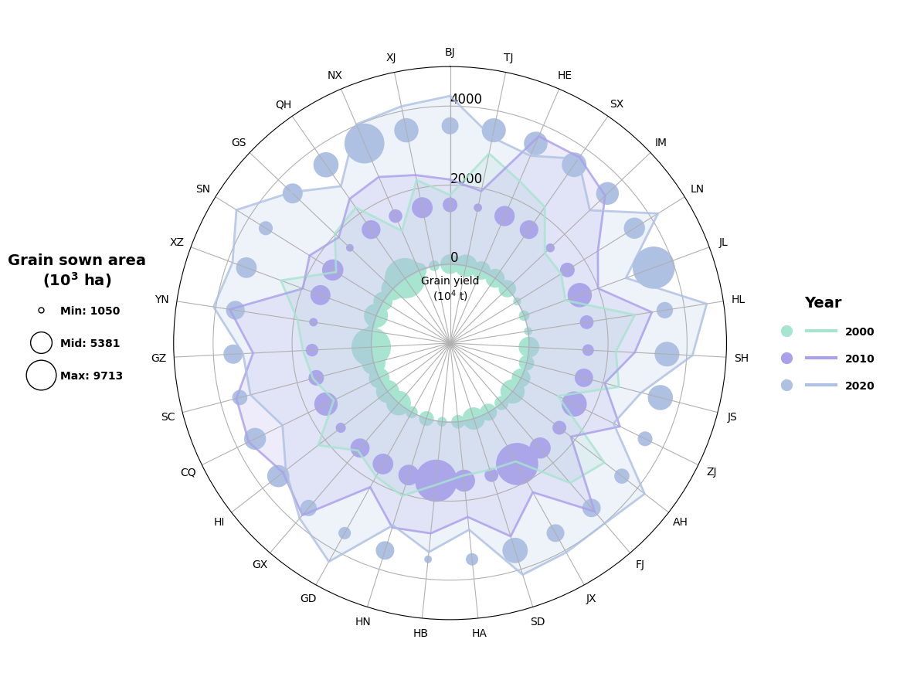

## ternary_map.ipynb
- 三元相统计地图

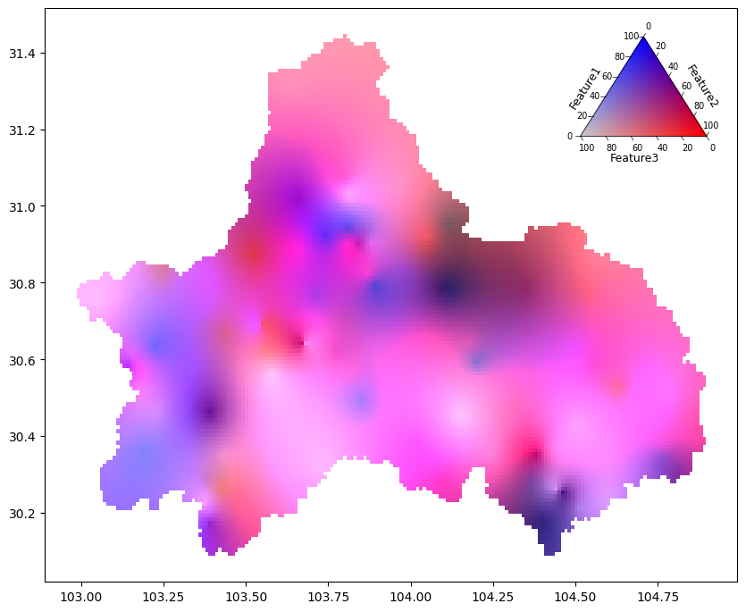

# 🚀持续更新

- 我会不断添加新的可视化示例，并优化现有内容！欢迎 star ⭐ 本项目，并关注后续更新。  

📬 欢迎交流：如果你对可视化方法、数据分析或城市研究感兴趣，欢迎提交 issue 或讨论你的想法！
